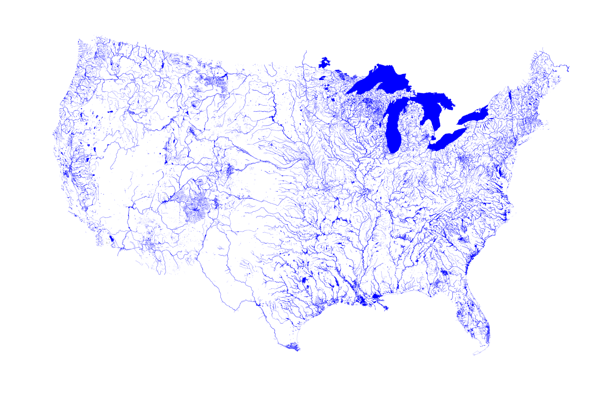
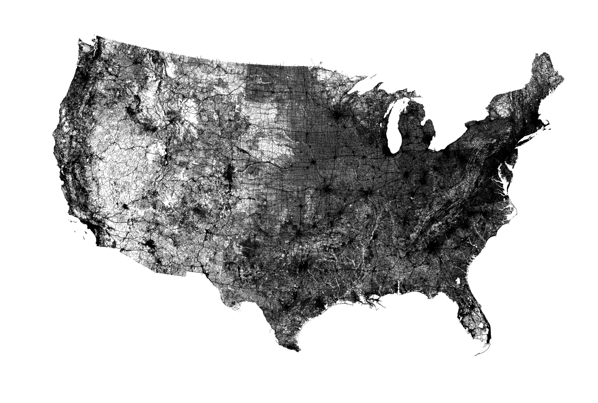

# All Rivers and lakes in the U.S. 

*Source: [OpenStreetMap](http://www.osm.org)*

*By [Michael Aschauer](https://m.ash.to/)*

A map of all Rivers and lakes in the U.S. as rendered from [OpenStreetMap](http://www.osm.org) data.

There is a few river and waterbasin maps floating around the net such as these from  [Nelson Minar](https://github.com/NelsonMinar/vector-river-map)
or [Mike Bostock](https://github.com/mbostock/us-rivers), also Prints from [Muir Way](https://muir-way.com/collections/hydrology-series) 
and [Grasshopper Geography](https://www.grasshoppergeography.com/River-Maps). 
They are all based on hydrological datasets such as [NHDPlus](https://nhdplus.com/NHDPlus/). What if one uses OSM? 
Not every desert wash, that floods once a year and stays dry the rest of it, will show up as a potential stream, 
but only rivers and freshwater body that were traced and tagged on OSM.  Streams weren't actually included in this rendering as 
it seems they are currently not consistently traced and tagged across the U.S.

*See also in [larger resolution](images/us-freshwater.png)*

With slight modifications you can run it over all 'highways' as well to get all roads.
See this remake of Ben Fry's legendary [All Streets](https://benfry.com/allstreets/map5.html) with OSM data ...

*Also available in [larger resolution](images/us-roads.png)*

... compare this to the States' railway network  ...

*Also available in [larger resolution](images/us-railways.png)*

.. Duh...
